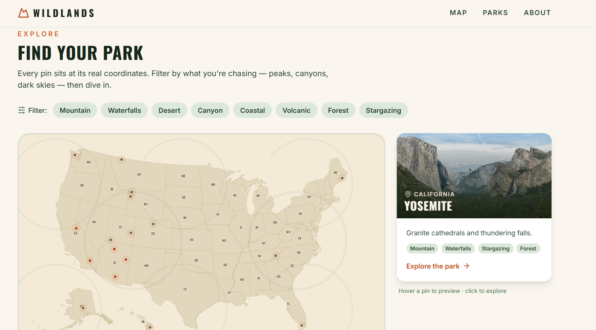
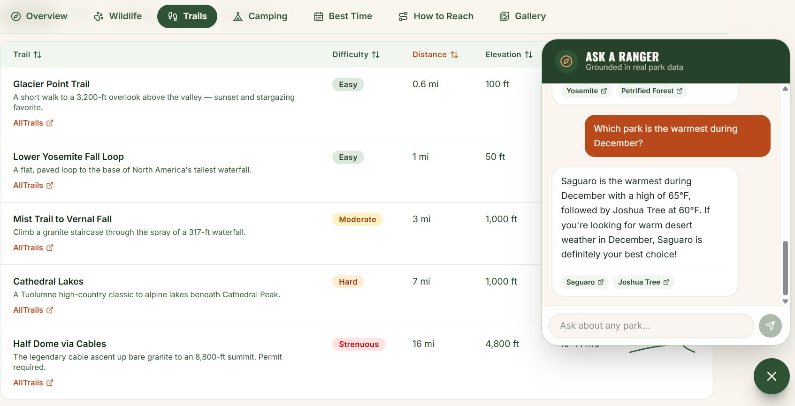

# Wildlands — U.S. National Parks

A full-stack, AI-powered guide to the U.S. National Parks: a cinematic landing
page with a geographically accurate interactive map, deep data-driven pages for
each park, and a retrieval-augmented (RAG) **"Ask a Ranger"** chatbot that
answers questions with cited, hallucination-resistant responses.

**🔗 Live demo: [find-your-wild.vercel.app](https://find-your-wild.vercel.app/)**

## Screenshots

**Interactive U.S. map — every pin at its real coordinates**



**"Ask a Ranger" — a RAG chatbot grounded in real park data, with citations**



## Features

### 🤖 "Ask a Ranger" — RAG assistant
A retrieval-augmented chatbot that answers natural-language questions about the
parks and **grounds every answer in real data with inline citations**:

- Park data is chunked and embedded with **Voyage AI** (`voyage-3`).
- Embeddings live in **Supabase Postgres + pgvector** (HNSW index, cosine search).
- At query time the question is embedded, the most relevant chunks are retrieved,
  and **Claude (Haiku 4.5)** answers using those chunks as cited source documents.
- Responses **stream token-by-token** over Server-Sent Events; citation chips
  link back to the relevant park page.
- Runs on **Vercel serverless functions** with all secrets kept server-side.

See [docs/ai-setup.md](docs/ai-setup.md) for the full architecture and setup.

### Landing page
- **Cinematic hero** with parallax scroll, an animated headline, and count-up stats.
- **Interactive U.S. map** (`react-simple-maps` + `d3-geo`, `geoAlbersUsa`
  projection) with **geographically accurate pins** — Alaska & Hawaii included
  via insets. Hover for a live preview; click to open a park.
- **Filter chips** (Mountain, Canyon, Desert, Coastal, Stargazing, …) that
  dim non-matching pins, plus state-abbreviation labels at each centroid.
- Map gracefully collapses to a **searchable card grid** on mobile.

### Park pages
Every park is rendered from a single typed `Park` object, so the template
scales to any park. Each page includes:
- **Cinematic hero** with parallax and photo attribution.
- **Animated stat strip** summarizing the park at a glance.
- **Tabbed sections** (the Camping tab only appears when a park has camping):
  - **Overview** — prose intro, an indigenous-history callout, a history
    timeline, and fun facts.
  - **Wildlife** — species cards with conservation-status badges + safety notes.
  - **Trails** — sortable/filterable table with elevation-profile sparklines
    and an **AllTrails** link per trail.
  - **Camping** — campsite cards with booking/permit badges, location maps
    links, and reserve links (handles parks with no developed campgrounds).
  - **Best Time** — interactive 12-month crowd & temperature chart.
  - **How to Reach** — airports, drive times, fees, hours, directions.
  - **Gallery** — 3×3 masonry with a keyboard-navigable lightbox.

### Throughout
- **Real, openly-licensed imagery** from Wikimedia Commons, with attribution.
- Graceful image fallbacks, `prefers-reduced-motion` support, responsive
  layouts, and route-level code splitting.

## Parks included

Fully built: **Yosemite**, **Grand Canyon**, **Saguaro**, **Petrified Forest**,
**Joshua Tree**. Additional marquee parks appear on the map as pins and join the
site as their data files are added.

## Tech Stack

**Frontend**
- **React 18 + TypeScript** (Vite)
- **Tailwind CSS v4** for styling, **Framer Motion** for animation
- **React Router** for routing + code splitting
- **react-simple-maps / d3-geo** + `us-atlas` for the map, **Recharts** for charts

**Backend / AI**
- **Node serverless functions** on **Vercel** (`/api`)
- **Anthropic Claude** (Haiku 4.5) — RAG generation with Citations + SSE streaming
- **Voyage AI** embeddings (`voyage-3`)
- **Supabase Postgres + pgvector** — vector store (HNSW, cosine similarity)

**Infra**
- **Vercel** — CDN, serverless, CI/CD auto-deploys from GitHub

## Getting Started

```bash
npm install
npm run dev      # Vite dev server (frontend only — /api is not served here)
npm run build    # type-check + production build
vercel dev       # run the app AND the /api functions locally (reads .env.local)
```

The AI features need API keys and a Supabase database — see
[docs/ai-setup.md](docs/ai-setup.md). The map and park pages work without them.

## Project Structure

```
api/                       # Vercel serverless functions
  chat.ts                  #   RAG "Ask a Ranger" (SSE streaming + citations)
  search.ts                #   semantic park search
lib/voyage.ts              # Voyage embeddings client (shared)
scripts/
  ingest.ts                # corpus → embeddings → Supabase (npm run ingest)
  fetch-images.mjs         # sources openly-licensed images from Wikimedia Commons
supabase/schema.sql        # pgvector table + index + match function
src/
  types/park.ts            # the Park + Campsite data contract
  data/                    # one file per park + registry + map-pin data
  components/
    ranger/RangerChat.tsx  # the chat widget
    landing/ park/ ui/      # map, hero, tabs, primitives
  pages/                   # Landing, ParkPage, ParkRoute, NotFound
```

## Adding a Park

1. Run `node scripts/fetch-images.mjs` to source openly-licensed images
   (9 gallery images per park, plus hero and wildlife shots) with attribution.
2. Create `src/data/<slug>.ts` exporting a `Park` object.
3. Register it in `src/data/parks.ts`, and add/flip its pin in
   `src/data/mapPoints.ts` (`built: true`).
4. Run `npm run ingest` so the "Ask a Ranger" assistant knows about the new park.

`<ParkPage />` renders everything else.

## Roadmap

- [ ] Wire semantic search into the map (natural-language → highlighted pins)
- [ ] More marquee parks (data files for the existing map pins)
- [ ] "Compare two parks" side-by-side view
- [ ] Live weather via Open-Meteo

> Data and imagery are for demonstration only. Plan real trips at
> [nps.gov](https://www.nps.gov).
